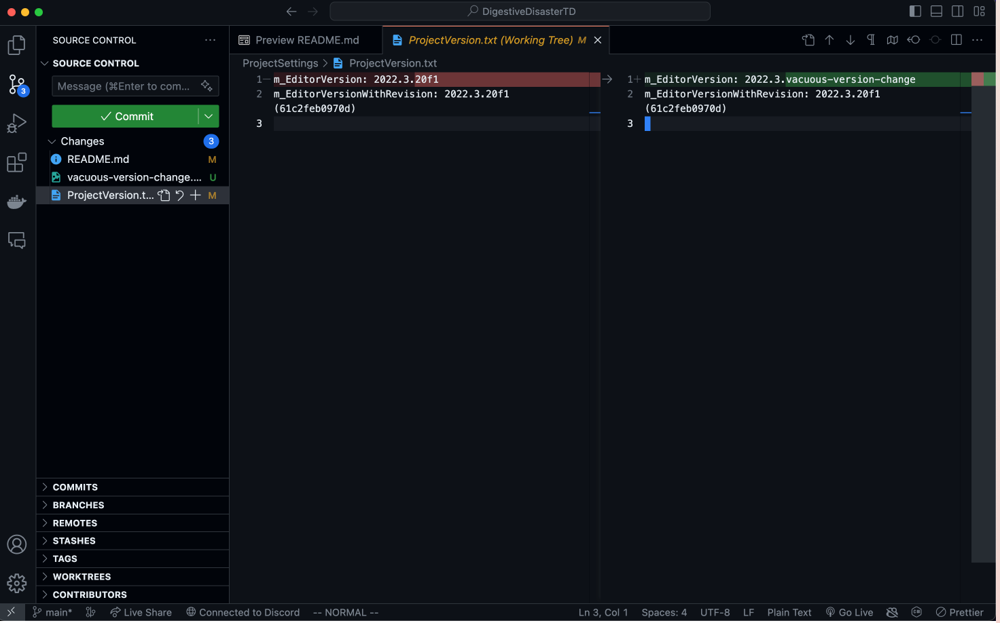

# Digestive Disaster TD

## Contributing with Feature Branch and Merging

For every single feature, create a branch off of main and only commit/push to that branch until that feature is done and ready to merge.

Once the feature is done and ready to be merged to main:

1. Switch to main branch with `git switch main`
2. Pull latest changes from main with `git pull` (In case others have finished a feature before you did)
3. Switch back to your feature branch with `git switch <your-feature-branch>`
4. Merge main into feature branch with `git merge main`
5. It will ask you to resolve any conflicts if necessary (Conflicts can arise when your feature changes contradict others', resolve wisely)
6. Switch back to main with `git switch main`
7. Merge with your feature with `git merge <your-feature-branch>` (This should have no conflicts)
8. Push to GitHub's main with `git push`
9. Delete your feature branch with `git branch -d <your-feature-branch>` (all your feature commits are on main so it is now safe)

The reason for merging main into feature first is to ensure that all merge conflicts happen in your feature branch and all pushes to the main branch have no conflict.

## Unity Version

Please make sure what changes you are commiting before you push to the repository.

DO NOT CHANGE THE `ProjectSettings/ProjectVersion.txt`.

To check what changes you made, run `git diff` before committing, or just look at your git editor on VS code:

